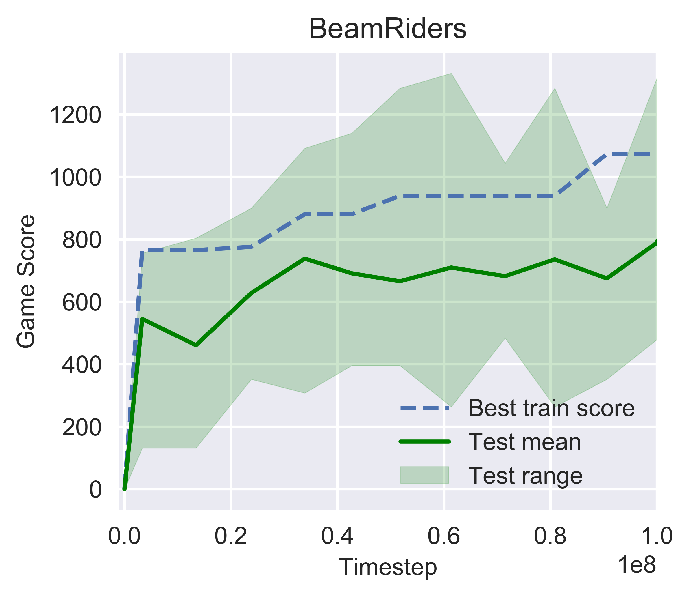
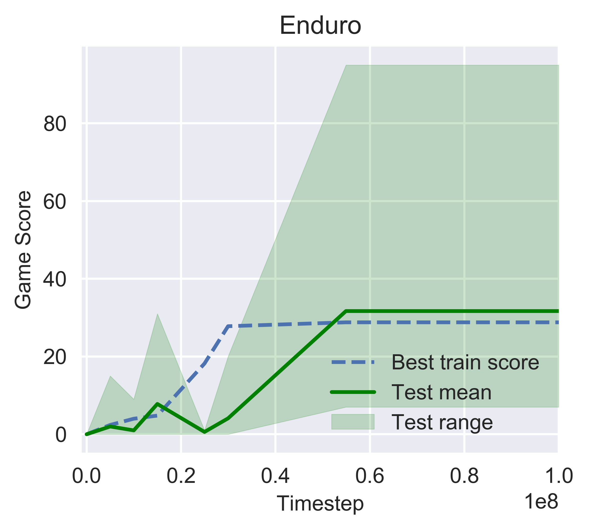
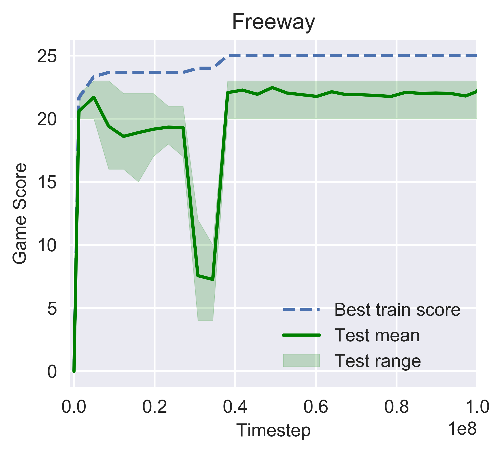

Negative Correlated Natural Evolution Strategy
===========================
#### Describution
This repository contains PyTorch implementations of Deep Reinforcement Learning with 'Negative Correlated Natural Evolution Strategy'(NCNES) algorithms.

#### Dependency
- gym0.12.1
- pytorch1.0.1
- python3.6.5

All Dependency can be imported by anaconda environment with environment.yml

#### Usage
```python main.py
python main.py 
[game]     Freeway,Enduro,Qbert,Alien..., default = Freeways
[ncpu]     numbers of cpu. default = 40 
[lr_mean]  learning rate of mean. default= 0.2 
[lr_sigma] laerning rate of sigma. default = 0.1 
[phi]      negative correlated search factor.default= 0.0001 
[sigma_init] initialization value of sigma. default= 2  
[eva]      max evaluate times.defalut = 3  
[lam]      numbers of population size. default = 5 
[mu]       numbers of offsprings in a population. default = 15
[parallel] parallel mode, default = p(parallel),option = s(serial), i(individual)
```

#### File Tree
├── readme.md                   // help  
├── log                         // log  
│   ├── namemark-time-phi-ft    // log  
│   ├── namemark-game-seed.pt   // pytorch saved model   
│   └── state.txt               // state log  
├── src  
│   ├──__init__.py              // init file  
│   ├── model.py                // class of neural network (model)   
│   ├── optimizer.py            // optimize and update function   
│   ├── preprocess.py           // class of preprocess transform  
│   ├── train.py                // train and test function   
│   ├── util.py                 // other function   
│   └── vbn.py                  // class and function about vitural batch   
├── environment.yml             // dependenct Installation file
└── main_all.py                 // run 

#### Results

We sampled more than 20 points during training and draw training curves as following figure shows.







The experiment repeated for 3 times and scores are shown in Table 1.


| Game      | Score1 | Score2 | Score3 |
| --------- | ------ | ------ | :----: |
| BeamRider | 856.8  | 620.4  | 719.3  |
| Freeway   | 22.7   | 21.1   |  22.1  |
| Enduro    | 29.8   | 8.7    |  11.5  |

#### Update log
1. Fixed noop frame           Add function to view and change the 30-no-ops frame setting and every no op setting corresponding to episode will be logged. 
2. Modified weight update     Weight update by `named_parameters` and `params.data` rather than `tmp = getsttr(tmp)`.
3. Modified random seed       Random seed are not fixed. Env seed, np.random, torch seed use `time.time()`.
4. Delete SGD optimizer       Delete SGD optimier and update directly.
5. Add `build_mean()`         To build gaussian distribution dictionary and initialize mean of Gaussian as `mean= L + (H-L) *rand`
6. Detele mirror sample       Delete mirror sample noise.
7. Modified `ARGS` class        Add set folderpath and checkpointname 
8. Modified sample noise      In `get reward atari()` ,noise are sampled directly rather than noise table and saved. Delete noise table.
9. Modified `optimize`         Diversity,fitness,fisher are incoporated into `optimize`.
10. Modified `logger`          Output logging in a more readable way.
11. Add `main_serial`          Run main in single process.
12. Intergrate `main_all`      Run all parallel mode in one file

#### Reference
\[1\] Peng Yang, Ke Tang, Xin Yao, "Negatively Correlated Search as a Parallel Exploration Search Strategy", arXiv-https://arxiv.org/abs/1910.07151, 2019

